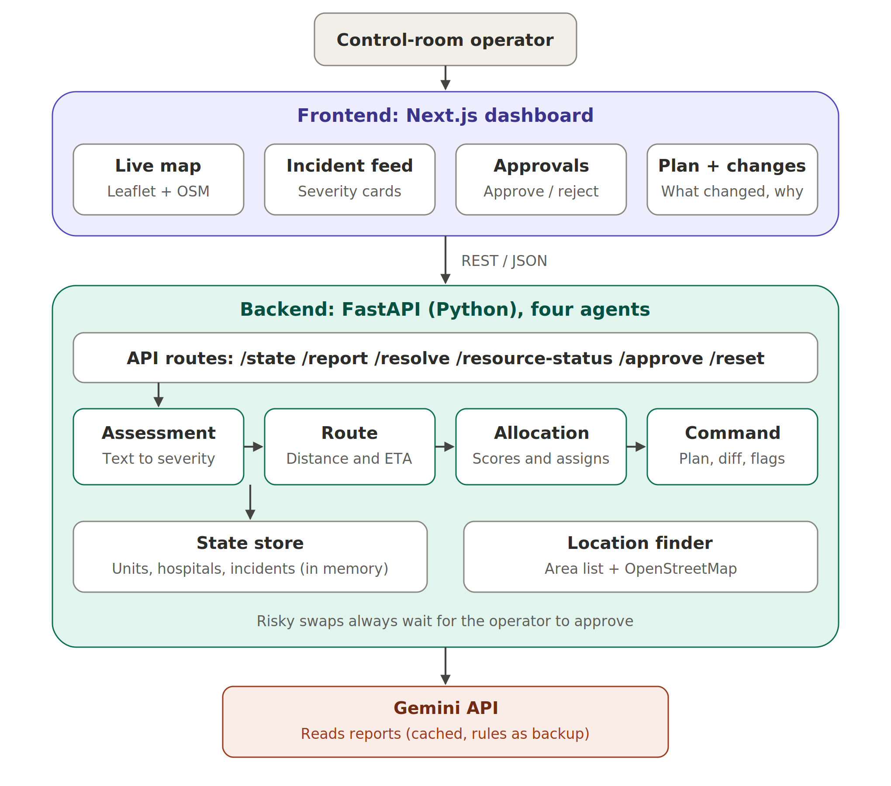

# Kairos

Live app: https://kairos-gd.vercel.app
Demo video: ADD-VIDEO-LINK
Backend API: https://kairos-backend-0436.onrender.com

Note: the backend runs on a free server that sleeps when unused, so the first request can take up to a minute. After that it's quick.

Kairos is an emergency response control room for Ahmedabad. You type what happened in normal words, like "bus overturned near Paldi, 15 people injured", and Kairos works out how serious it is, sends the nearest ambulances, fire trucks and rescue teams, and keeps updating the plan when things change.

We made it for Gateways 2026 (Domain 4, Public Safety & Emergency Response, problem statement "Crisis Command").

Team Golden Dawn

- Khush Chaturvedi, backend and agents
- Manushi Panchal, frontend

Kairos is a Greek word for the right moment, the one where acting quickly matters most. Felt like a good name for this.

## Why we built this

When multiple emergencies happen at once, the control room has to decide very fast which unit goes where, and there are never enough units. On top of that the situation keeps changing. A bigger incident comes in, an ambulance breaks down, a case gets closed. Each of these changes the whole plan, and redoing it by hand under pressure is slow and easy to get wrong.

We wanted to see if a set of small agents could take care of the planning part, while the operator stays in charge of the big decisions.

## What it can do

You report an emergency in plain text. You can add an area name like "Kalupur" or click on the map, but both are optional. You don't pick the type or severity, Kairos figures that out from the text.

It then assigns units and shows everything on the map. Every time something changes (new report, unit out of service, incident closed) it replans and shows what changed and the reason for each change.

Some decisions are risky, like taking a fire truck away from one fire to send it to a worse one. Kairos never does those on its own. It suggests the swap and waits for the operator to approve or reject it.

If there aren't enough units, the status bar says which incident is still waiting and how many units it's short.

## How it works



The backend has four agents that run in order whenever something changes.

1. Assessment reads the report and decides the type, number of people, severity (1 to 5) and which units are needed. It asks Gemini to read the text. If Gemini is slow, down or out of quota, it uses our own keyword rules instead.
2. Route estimates how far each unit is from each incident and how long it would take to get there.
3. Allocation decides who goes where. First every incident gets at least one unit, then the serious ones get the rest. Units that are already working somewhere stay there unless they really need to move.
4. Command compares the new plan with the old one, writes a reason for each change, picks the nearest hospital that still has beds, and creates approval requests.

We kept one rule throughout: the AI only reads the reports, it doesn't make the dispatch decisions. The allocation is normal scoring code, so the same situation always gives the same plan and we can explain every decision.

Some cases we specifically handled:

- If a change happens in the middle of a response, only the units that have to move are moved.
- Vague reports ("some people hurt near Kankaria, caller not sure how many") get a slightly higher severity to be safe, and the operator is asked to verify them.
- If the location can't be found, we first check a list of 40+ Ahmedabad areas (works offline), then OpenStreetMap. If both fail, the incident goes to the city centre and gets flagged.
- AI answers are cached. If a Gemini call fails, we skip the AI for 2 minutes and use rules, so the dashboard doesn't hang.

## Tech we used

Next.js, TypeScript and Tailwind for the frontend, with Leaflet and OpenStreetMap for the map.
Python and FastAPI for the backend.
Google Gemini for reading the reports (optional, the app runs fine without a key).
The units, hospitals and shelters are simulated but placed at real locations in Ahmedabad.

## Running it on your machine

You'll need Python 3.11 or newer and Node.js 20 or newer.

Backend:

```bash
cd backend
python3 -m venv .venv
source .venv/bin/activate        # Windows: .venv\Scripts\activate
pip install fastapi "uvicorn[standard]" python-dotenv google-genai requests
uvicorn main:app --reload --port 8000
```

If you want the AI part, make a file called `backend/.env` with:

```
GEMINI_API_KEY=your-key-here
GEMINI_MODEL=gemini-3.8-flash
```

Frontend (in a second terminal):

```bash
cd frontend
npm install
npm run dev
```

Then open http://localhost:3000.

If you just want to check the backend logic without the UI, run `python check_demo.py` inside the backend folder. It goes through a full scenario and prints what Kairos decided at each step.

## Things to try

1. The app starts empty, all 13 units on standby.
2. Report "Bus overturned, around 15 passengers injured and 3 trapped" with area "Paldi". Watch the units get assigned and read the reasons under What Changed.
3. Click one of those ambulances on the map and mark it out of service. Kairos sends a replacement.
4. Report a fire in a shop near "Lal Darwaja", then a big gas leak in "Kalupur". Kairos will suggest swapping the fire trucks and wait for you.
5. Resolve an incident from the feed. Its units become free again.

There's also a "Next Demo Event" button that plays a short scripted scenario, in case you want to see everything without typing.

## API

- `GET /state` returns everything
- `POST /report` adds an emergency (`description`, and optionally `address`, `lat`, `lng`, `title`)
- `POST /resolve` closes an incident
- `POST /resource-status` marks a unit out of service or back in service
- `POST /approve` approves or rejects a swap
- `POST /event` plays the next demo step
- `POST /reset` clears everything

The full data format is in [CONTRACT.md](CONTRACT.md).

## Limitations

This was built in 24 hours, so there are some things we'd do differently with more time:

- Travel time uses straight line distance with a road factor, not real traffic. Swapping in a routing API would only change one function.
- Everything is stored in memory, so restarting the server clears it. A real version would use a database.
- The fleet and hospital data is simulated since live 108 and fire service data isn't public.
- No login yet. A real control room would need operator accounts.
